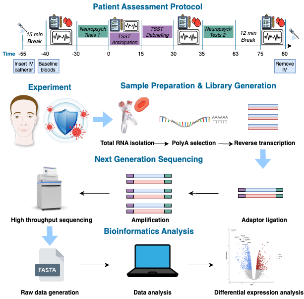
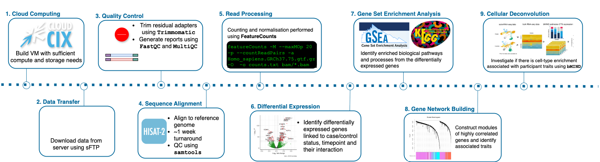

## RNA-seq Analysis to Investigate Immune Function and Stress Response in an Irish Schizophrenia Case-Control Study

### Overview

Immune factors are known to play a role in SZ, however their mechanisms remain largely unexplored. Blood based transcriptomic studies have valuable potential to investigate their complex interplay. This research, as part of the Immune Response & Social Cognition in Schizophrenia (iRELATE) project seeks to disentangle the complex genetic architecture of stress and schizophrenia (SZ) by investigating the presence of differentially expressed genes, enrichment for genes associated with disrupted cells, tissues and pathways, constructing new gene networks and their association with clinical and psychiatric phenotypes and examining cell type proportions

I received funding valued at €30,000 to generate RNA-sequencing data from the iRELATE study, which I used to complete this analysis. RNA-seq was performed for blood-based samples for 50 SZ cases and 50 healthy controls, before and after a stress test. The steps in this RNA-seq analysis workflow outlined in this repository include cloud computing set-up, sample QC, sequence alignment, post-alignment QC, read counting, differential expression analysis (DEA), gene enrichment analysis, weighted gene co-expression network analysis (WGCNA) and cellular deconvolution.

DEA identified 2,545 DEGs associated with SZ status and 770 DEGs associated with stress response. DEGs for SZ indicated immune responses, while DEGs for stress-test response were biologically aligned. Gene network construction identified one network was enriched for positive symptoms of SZ. One constructed module for SZ was found to be significantly enriched for CNS demyelination processes. Cell type proportions reveal a significant enrichment for T-cells CD8 associated with SZ. This study provides evidence for the relationship between immune response and SZ, and identifies biologically relevant genes, pathways and gene networks. This project also demonstrates that blood-based RNA-seq studies can lead to significant findings on the role of immune function in psychiatry and reveal the underpinning of its pathophysiology.

:speech_balloon: [Poster from World Congress of Psychiatric Genetics](media/WCPG_2024.pdf) — Singapore, 2024

### Project Description

This repository documents the analytical workflow for an RNA-seq analysis I developed to investigate immune dysregulation using blood-based transcriptomic data from the Immune Response and Social Cognition Study (iRELATE). This project was completed in part fulfillment of my PhD thesis titled '*Multiomic analysis of neuropsychiatric disorders*'. I completed a PhD in Genomics Data Science as a student of the SFI Centre for Research Training in Genomics Data Science.

#### Overview of experimental design and analytical workflow.

  

> **A.** In the Patient Assessment Protocol, blood samples and neuropsychiatric tests are taken before and after the Trier Social Stress Test (TSST). 
**B.** In Sample Preparation & Library Generation, total RNA is isolated, polyadenylated, and sequenced using complementary DNA (cDNA). In Bioinformatics Analysis, DEA is used to identify differentially expressed genes and explore the biological pathophysiology linked to SZ and or stress response.

#### RNA-Seq analysis workflow included exploratory analysis such as differential expression, gene-set enrichment and cellular deconvolution.

A number of bioinformatics tools were used in this project. Scripts on analysis methods are available in their respective subdirectories for each analysis step however post-alignment analysis was mostly carried out in R using the tools DESeq2 for DEA, WGCNA for gene network construction and bMIND for cellular deconvolution.

  

#### Step 1: RNA-Seq Data Processing

-   **Quality Control (QC):** Checking read quality with FastQC and MultiQC.

-   **Read Alignment:** Mapping reads to the reference genome using HISAT2.

-   **Normalization & Batch Correction:** Correcting for technical biases using DESeq2 and edgeR.

#### Step 2: Differential Gene Expression (DGE) Analysis

-   **Case-Control Comparison:** Identifying up/downregulated genes.

-   **Statistical Significance Testing:** Adjusting for multiple comparisons (FDR correction).

#### Step 3: Functional & Pathway Analysis

-   **Gene Ontology (GO) & Pathway Enrichment:** Investigating biological implications.

-   **Cell-Type Deconvolution:** Estimating immune cell proportions within bulk RNA-seq samples.

-   **Visualization:** Generating volcano plots, heatmaps, and PCA plots.

#### Required Software & Dependencies

-   FastQC, MultiQC (QC)

-   HISAT2 (Read alignment)

-   DESeq2, edgeR (Differential expression analysis)

-   CIBERSORT (Cellular deconvolution)

-   R & Bioconductor (Statistical analysis, visualization)
