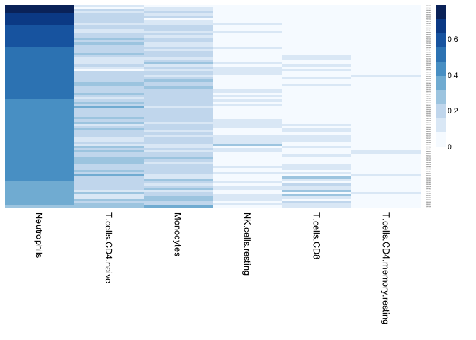
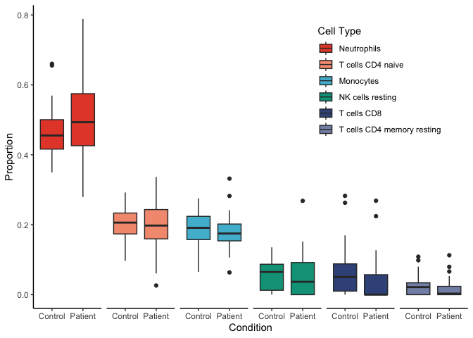

Cellular Deconvolution
================
Shane Crinion
2025-10-21

Script to perform cellular deconvolution on the count data to identify
significant differences in blood-based data that indicate cell-type
specific activity.

### 1. Libraries

Import libraries to perform analysis.

``` r
library(MIND)
library(data.table)
library(DESeq2)
library(dplyr)
library(readr)
library(tidyr)
library(stringr)
library(NMF)
library(RColorBrewer)
library(ggpubr)
# create boxplots of the proportions
library(reshape2)
library(ggplot2)
```

### 2. Import and format data

Import bulk count data and sample meta-data for case-control status.

``` r
bulk <- read.delim('counts.27-07-2024.txt')
meta <- read.csv('rnaseq_metadata.csv', row.names = 1)
```

Prep and format count data for bMIND.

``` r
# bmind can't handle duplicate gene names so removing duplicates
counts_w_gene_name <- bulk %>% distinct(external_gene_name, .keep_all=T)

# remove blanks
counts_w_gene_name <- counts_w_gene_name[!counts_w_gene_name$external_gene_name=='', ]
counts_w_gene_name <- counts_w_gene_name[!is.na(counts_w_gene_name$external_gene_name), ]

# remove original ensebml ids
counts_w_gene_name <- counts_w_gene_name[,-1]

# reorder so gene names are first
counts_w_gene_name <- counts_w_gene_name[, c(93, 1:92)]

# assign gene names as row names
row.names(counts_w_gene_name) <- counts_w_gene_name$external_gene_name

# remove external gene name as column
counts_w_gene_name <- subset(counts_w_gene_name, select=-external_gene_name)

# filter to prevent crashing
keep <- rowSums(counts_w_gene_name >= 10) >= 10 # remove counts with > 10 in > 10 samples
bulk <- counts_w_gene_name[keep,]
nrow(bulk) # 18874
```

    ## [1] 18874

``` r
#write.table(bulk, 'decomposition-input-matrix.27-7-24.txt', sep = '\t', quote = F)
```

Convert read count to CPM (counts per million).

``` r
gene_name = row.names(bulk)
bulk_count = as.matrix(as.data.frame(bulk))
rownames(bulk_count) = gene_name
bulk_cpm = apply(bulk_count, 2, function(x) x/sum(x)*1e6)
#write.table(bulk_cpm, 'decomposition-input-matrix.27-7-24.cpm.txt', sep='\t', quote=F, row.names = T)
```

Import the reference file from CIBERSORTx on expression profiles for
immune cells.

``` r
# import immune signature file
signature = read.delim('LM22.txt', row.names = 1)
```

Convert the immune cell expression reference to log-transformed values.

``` r
# Running est_frac()
sig = log2(as.matrix(signature) + 1)
sig = sig[intersect(rownames(sig), rownames(bulk)),]
bulk = log2(bulk_cpm[intersect(rownames(sig), rownames(bulk)),] + 1)
```

### 3. Run Analysis

Run the analysis to estimate cell type proportions for each sample.

``` r
# get the proportion of cell type per sample
cell_fraction = est_frac(sig, bulk)
```

    ## Loading required package: nnls

    ##                B.cells.naive               B.cells.memory 
    ##                         0.00                         0.00 
    ##                 Plasma.cells                  T.cells.CD8 
    ##                         0.00                         0.05 
    ##            T.cells.CD4.naive   T.cells.CD4.memory.resting 
    ##                         0.20                         0.02 
    ## T.cells.CD4.memory.activated    T.cells.follicular.helper 
    ##                         0.00                         0.00 
    ##   T.cells.regulatory..Tregs.          T.cells.gamma.delta 
    ##                         0.00                         0.00 
    ##             NK.cells.resting           NK.cells.activated 
    ##                         0.06                         0.00 
    ##                    Monocytes               Macrophages.M0 
    ##                         0.18                         0.00 
    ##               Macrophages.M1               Macrophages.M2 
    ##                         0.00                         0.00 
    ##      Dendritic.cells.resting    Dendritic.cells.activated 
    ##                         0.00                         0.00 
    ##           Mast.cells.resting         Mast.cells.activated 
    ##                         0.00                         0.00 
    ##                  Eosinophils                  Neutrophils 
    ##                         0.00                         0.48

``` r
# the subset with proportion > 0 
cell_fraction.subset <- cell_fraction[,c('Neutrophils', 'T.cells.CD4.naive', 'Monocytes', 
                            'NK.cells.resting', 'T.cells.CD8', 'T.cells.CD4.memory.resting')]

#write.table(cell_fraction, 'cell_fraction.bmind.27-7-24.txt', quote = F, sep='\t')
```

Get fraction of cell type estimate for each sample.

``` r
region = colnames(bulk)
frac_region = apply(cell_fraction.subset, 2, function(x) tapply(x, region, mean))

#write.table(frac_region, 'frac_region.bmind.27-7-24.txt', quote = F, sep='\t')
```

Subset and re-arrange the data

``` r
frac_region <- as.data.frame(frac_region) %>% arrange(-Neutrophils, T.cells.CD4.naive, Monocytes, NK.cells.resting, T.cells.CD8, T.cells.CD4.memory.resting)
frac_region <- frac_region[,c('Neutrophils', 'T.cells.CD4.naive', 'Monocytes', 'NK.cells.resting', 'T.cells.CD8', 'T.cells.CD4.memory.resting')]
#write.csv(frac_region, 'cell_decomp_bmind.csv')

head(frac_region)
```

    ##        Neutrophils T.cells.CD4.naive  Monocytes NK.cells.resting T.cells.CD8
    ## PSR197   0.7887113        0.14777595 0.06351277       0.00000000           0
    ## PSR020   0.7633067        0.02619328 0.13192612       0.07857386           0
    ## PSR090   0.7323235        0.16142011 0.10625635       0.00000000           0
    ## PSR194   0.7292496        0.09825448 0.17249594       0.00000000           0
    ## PSR042   0.6610403        0.19767679 0.14128287       0.00000000           0
    ## PSR099   0.6603591        0.15942966 0.18021119       0.00000000           0
    ##        T.cells.CD4.memory.resting
    ## PSR197                          0
    ## PSR020                          0
    ## PSR090                          0
    ## PSR194                          0
    ## PSR042                          0
    ## PSR099                          0

### 4. Plot cell fractions

**Sample-by-sample breakdown:**

Firstly, plot the proportion of each cell type for each sample to
investigate the spread of estimated cell proportion.

``` r
# plot the fractional regions 
aheatmap(frac_region, color = 'Blues', Rowv = NA, Colv = NA,fontsize = 8,
         treeheight = 0,subsetCol = c('Neutrophils', 'T.cells.CD4.naive', 
                                      'Monocytes', 'NK.cells.resting',
                                      'T.cells.CD8', 'T.cells.CD4.memory.resting'))
```

<!-- -->

**Case-control comparison**

Format the data to make the comparison.

``` r
# combine the fractional 
df <- merge(x=frac_region, y=meta, all.x = T, by='row.names')

# remove samples that failed 
df <- df[!df$Row.names %in% c('PSR013', 'PSR189', 'PSR007', 'PSR086') ,]

# restructure df for plotting 
df.melt <- melt(df, id.vars = 'Condition', 
                measure.vars = c('Neutrophils', 'T.cells.CD4.naive', 
                                 'Monocytes', 'NK.cells.resting',
                                 'T.cells.CD8', 'T.cells.CD4.memory.resting'))

# put appropriate column names for the plot
names(df.melt) <- c('condition', 'cell_type', 'proportion')
df.melt$cell_type <- str_replace_all(df.melt$cell_type , '\\.',  ' ')
df.melt$cell_type <- factor(df.melt$cell_type, levels=c('Neutrophils', 'T cells CD4 naive', 
                                                            'Monocytes', 'NK cells resting',
                                                            'T cells CD8', 'T cells CD4 memory resting'))
df.melt$condition <- as.factor(df.melt$condition)
```

Define a colour pallete.

``` r
custom_colors <- c("Neutrophils" = "#E64B35",       # red
                   "T cells CD4 naive" = "#F39B7F", # orange-pink
                   "Monocytes" = "#4DBBD5",        # blue
                   "NK cells resting" = "#00A087", # teal
                   "T cells CD8" = "#3C5488",      # dark blue
                   "T cells CD4 memory resting" = "#8491B4") # lavender-blue
```

Plot the comparison of cell type proportion estimated for cases vs
controls.

``` r
# Modify the ggplot code
p <- ggplot(df.melt,x=condition, y=proportion, 
            aes(x=condition, y=proportion, fill=cell_type)) + 
  geom_boxplot() + 
  labs(fill = "Cell Type") +  # Change the legend title
  scale_fill_manual(values = custom_colors) +  # Apply custom fill colors
  facet_grid(cols = vars(cell_type),) + xlab('Condition') + ylab('Proportion') + 
  theme_classic()  +   theme(
    strip.text = element_blank(),  # Remove facet labels,
    # legend.title = 'Cell Type',
    legend.position = c(0.95, 0.95),  # Position legend near top-right (x, y)
    legend.justification = c(1, 1), # Align legend to the top-right corner
    legend.background = element_rect(fill = "white", color = NA)  # Optional: white legend background
    )
#ggsave('cell_type_proportions.png', dpi=300)
```

``` r
p
```

<!-- -->

### 5. Test for significant difference between the Control and Patient groups

Use Shapiro test to determine whether wilcox or t-tests should be used
based on spread of data.

``` r
# Function to check normality
check_normality <- function(data) {
  p_values <- data %>%
    group_by(cell_type) %>%
    summarise(p_value = shapiro.test(proportion)$p.value)
  return(p_values)}

normality_results <- check_normality(df.melt)
print(normality_results) 
```

    ## # A tibble: 6 × 2
    ##   cell_type                   p_value
    ##   <fct>                         <dbl>
    ## 1 Neutrophils                8.66e- 4
    ## 2 T cells CD4 naive          6.21e- 1
    ## 3 Monocytes                  7.08e- 1
    ## 4 NK cells resting           1.12e- 6
    ## 5 T cells CD8                4.84e-10
    ## 6 T cells CD4 memory resting 7.55e-10

``` r
subset(normality_results, p_value<(0.05/6))
```

    ## # A tibble: 4 × 2
    ##   cell_type                   p_value
    ##   <fct>                         <dbl>
    ## 1 Neutrophils                8.66e- 4
    ## 2 NK cells resting           1.12e- 6
    ## 3 T cells CD8                4.84e-10
    ## 4 T cells CD4 memory resting 7.55e-10

Create function to perform either a t-test or Wilcoxon test.

``` r
perform_tests <- function(data) {
  test_results <- data %>%
    group_by(cell_type) %>%
    do({
      condition_data <- .
      test_type <- if (shapiro.test(condition_data$proportion)$p.value > 0.05) {
        "t-test"
      } else {
        "wilcox"
      }
      p_value <- if (test_type == "t-test") {
        t.test(proportion ~ condition, data = condition_data)$p.value
      } else {
        wilcox.test(proportion ~ condition, data = condition_data)$p.value
      }
      data.frame(test_type = test_type, p_value = p_value)
    })
  return(test_results)
}
```

Identify significant differences between cases and controls.

``` r
sigtest.diff <- perform_tests(df.melt)
subset(sigtest.diff, p_value<(0.05/5))
```

    ## # A tibble: 1 × 3
    ## # Groups:   cell_type [1]
    ##   cell_type   test_type p_value
    ##   <fct>       <chr>       <dbl>
    ## 1 T cells CD8 wilcox    0.00891
