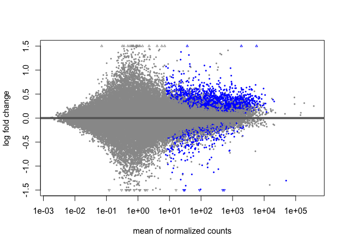
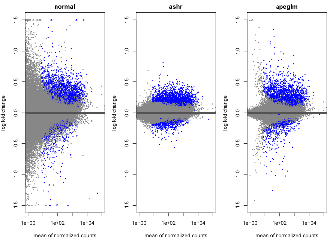
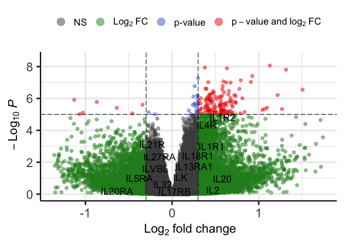
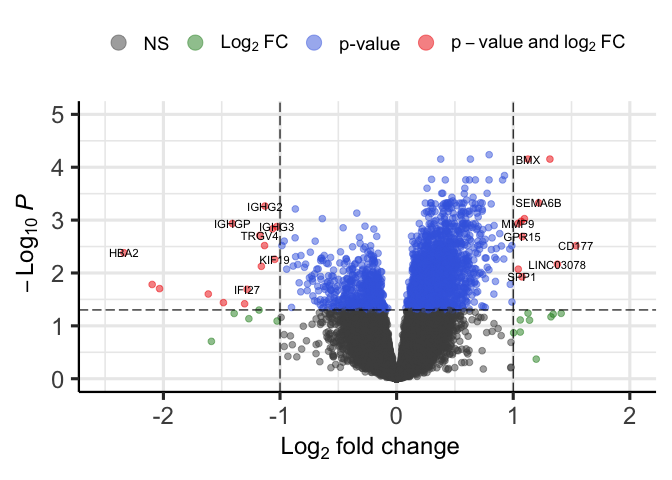

Explore DEA Results
================
Shane Crinion
2025-10-20

Libraries:

``` r
library(DESeq2)
library(EnhancedVolcano)
library(apeglm)
library(ashr)
```

Import DESeq2 object:

``` r
# ├── import using dds 
dds <- readRDS('../dds_covarIncluded.rds')
```

Import gene names for labelling:

``` r
# import gene names
gene_info <- readRDS('geneIDs.rds')
```

Extract the results table for the Patient vs Control analysis:

``` r
results <- results(dds, alpha=0.05, test='Wald', name='Condition_Patient_vs_Control')
results$ensembl <- row.names(results)
```

Annotate the results with gene names:

``` r
results_w_gene_name <- merge(as.data.frame(results),
                             gene_info, 
                             by.x='ensembl',
                             by.y='ensembl_gene_id',
                             all.x=T, all.y=F)
#write.csv(subset(results_w_gene_name, padj<0.05), 'caseControl_padj05.csv')
```

### 2. Visualisations

We will generate a number of visualisations to understand the underlying
patterns of the data.

We will make MA plots, volcano plots, heatmaps, plot counts, and
clustering dendrograms

### 2.1. MA-plot

MA-plots are used to show the log2 fold change (M) between cases and
controls over the average expression level (A) of genes across all
samples. Blue indicates the adjusted p-value is less than 0.05.

``` r
plotMA(results, alpha=0.05, ylim=c(-1.5,1.5))
```

<!-- -->

The above is based on a normal prior distribution, centered on zero and
with a scale that is fit to the data. Shrunken log2 fold changes can
remove the noise associated with low read counts and create improved
visualisations. Here we shrink log2 fold change values using the ASHR
and APEGLM methods to improve visualisations.

First, we generate the shrunk results using the adaptive t prior
shrinkage estimator (apeglm) and the adaptive shrinkage estimator
(ashr):

``` r
resultsASHR <- lfcShrink(dds, res = results,
                         coef='Condition_Patient_vs_Control',
                         type="ashr")
```

    ## using 'ashr' for LFC shrinkage. If used in published research, please cite:
    ##     Stephens, M. (2016) False discovery rates: a new deal. Biostatistics, 18:2.
    ##     https://doi.org/10.1093/biostatistics/kxw041

``` r
resultsApeglm <- lfcShrink(dds, res = results,
                           coef='Condition_Patient_vs_Control',
                           type="apeglm")
```

    ## using 'apeglm' for LFC shrinkage. If used in published research, please cite:
    ##     Zhu, A., Ibrahim, J.G., Love, M.I. (2018) Heavy-tailed prior distributions for
    ##     sequence count data: removing the noise and preserving large differences.
    ##     Bioinformatics. https://doi.org/10.1093/bioinformatics/bty895

Next, we compare the normal and shrunken estimators.

``` r
par(mfrow=c(1,3), mar=c(4,4,2,1))
xlim <- c(1,1e5); ylim <- c(-1.5,1.5)
plotMA(results, xlim=xlim, ylim=ylim, main="normal")
plotMA(resultsASHR, xlim=xlim, ylim=ylim, main="ashr")
plotMA(resultsApeglm, xlim=xlim, ylim=ylim, main="apeglm")
```

<!-- -->

*Interpretation:* The effect change estimators do generate improved
visualisation of the gene expression changes linked to schizophrenia.
The apeglm method appears to represent these changes most clearly. Blue
points indicate genes that are significantly differentially expressed.
There are more significantly upregulated genes than significantly
downregulated genes between cases and controls. Many genes are far from
the centre line, indicating that expression of these genes is likely
linked to the schizophrenia. The distribution of points is generally
evenly spread, indicating that there does not appear to be any technical
artifacts or batch effects.

### 2.2. Volcano plots

We generate volcano plots to compare log fold change to statistical
significance. Here we can see individual genes and may identify genes
that have been previously linked to schizophrenia or the immune
response.

First we investigated IL genes due to the immune aspect of the project.

``` r
#BiocManager::install('EnhancedVolcano')
  EnhancedVolcano(results_w_gene_name,
    lab = results_w_gene_name$external_gene_name,
    selectLab = results_w_gene_name[grep('^IL', results_w_gene_name$external_gene_name),
                                    'external_gene_name'],
    FCcutoff = 0.3,
    x = 'log2FoldChange', subtitle= NULL, 
    caption = NULL, title = NULL,
    xlim=c(-1.362953,1.745288), # min, max 2fc
    y = 'pvalue',
    ylim=c(0,8.5)) # min, max log10 pvalue + .5
```

<!-- -->

``` r
#ggsave('vp_IL.png', dpi=1200)
#getwd()
```

*Interpretation* The upper right quadrant shows that there are a number
of genes that are signifcantly upregulated. We added labels to all genes
beginning in “IL” to investigate immune related genes however, we did
not find that any of these had significant differential expression. We
will investigate what genes do show as significant in the next plot.

``` r
EnhancedVolcano(results_w_gene_name, 
                lab = results_w_gene_name$external_gene_name,
            #    selectLab = results_w_gene_name[grep('^IL',  results_w_gene_name$external_gene_name),'external_gene_name'],
                x = 'log2FoldChange', y='padj', labSize = 3,
                xlim=c(-2.5,2), ylim=c(0,5), pCutoff = 0.05,
                legendPosition = 'top',
                title = NULL, subtitle = NULL, caption=NULL)
```

<!-- -->

``` r
#ggsave('volcanoPlot_SZstatusVsControls.png', dpi=1200)
```

A number of significantly up and down regulated genes were detected
between cases and controls. We take a further look at these below to
investigate the number of genes above padj/log2FoldChange thresholds:

``` r
# subset(results_w_gene_name, padj < 0.05) # 2545
sum(results_w_gene_name$padj<0.05 & abs(results_w_gene_name$log2FoldChange) > 0.5,na.rm=T) # 372
```

    ## [1] 372

``` r
sum(results_w_gene_name$padj<0.05 & abs(results_w_gene_name$log2FoldChange) > 0.3,na.rm=T) # 1287
```

    ## [1] 1287

Let’s take a look at the top genes:

``` r
head(results_w_gene_name[order(results_w_gene_name$padj, results_w_gene_name$pvalue),])
```

    ##               ensembl   baseMean log2FoldChange      lfcSE     stat
    ## 9543  ENSG00000151715   83.99284      0.7935820 0.13325583 5.955327
    ## 2632  ENSG00000102010   44.03223      1.1268391 0.19577057 5.755916
    ## 2399  ENSG00000100731 3374.25314      0.3781751 0.06627427 5.706213
    ## 5601  ENSG00000124588  409.54258      0.6328470 0.11126501 5.687745
    ## 46371 ENSG00000253459   41.19418      1.3145927 0.23251985 5.653679
    ## 60130 ENSG00000269468   28.62540      0.9249766 0.16825796 5.497372
    ##             pvalue         padj external_gene_name
    ## 9543  2.595520e-09 5.798393e-05            TMEM45B
    ## 2632  8.617299e-09 7.016958e-05                BMX
    ## 2399  1.155173e-08 7.016958e-05              PCNX1
    ## 5601  1.287278e-08 7.016958e-05               NQO2
    ## 46371 1.570492e-08 7.016958e-05               <NA>
    ## 60130 3.854930e-08 1.435319e-04               <NA>
