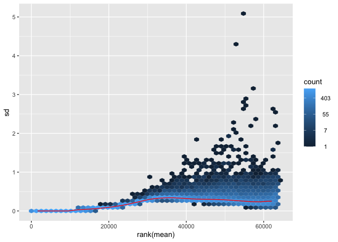
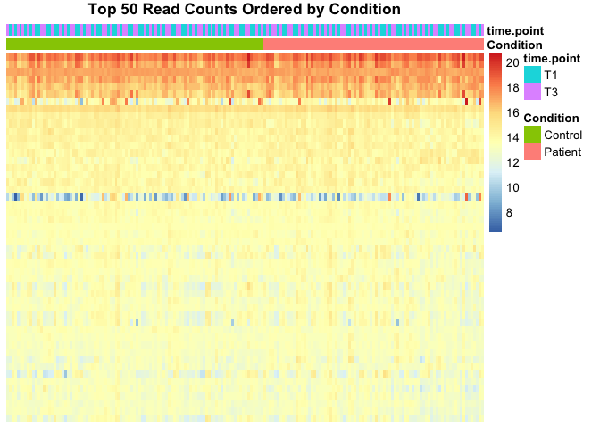
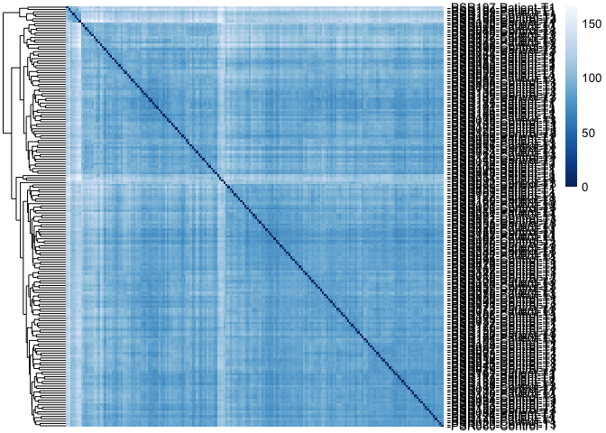

Data QC plots
================
2024-05-01

Here we will generate a number of plots to investigate the count data.
However, while we use raw counts and discrete distributions to explore
differential expression, transformed versions of the count data are
better for some downstream analyses such as clustering and heatmaps.

The report is based on the guidance
[here](https://bioconductor.org/packages/devel/bioc/vignettes/DESeq2/inst/doc/DESeq2.html#data-transformations-and-visualization)
and uses descriptions from this tutorial for the transformation.

### 1. Library and Data Import

``` r
library(DESeq2)
library("vsn")
library("pheatmap")
library("RColorBrewer")
library(tidyverse)
```

Import DESeq2 object:

``` r
# ├── import using dds 
dds <- readRDS('~/Documents/dev/dev2/remake/dds_countFiltered.rds')
```

### 2. Extract Transformed Data

We will variance stabilizing transformations (VST) which incorporates a
prior on the sample differences. This transforms data on the log2 scale
which has been normalized with respect to library size or other
normalization factors.

The point of this transformation is to remove the dependence of the
variance on the mean, particularly the high variance of the logarithm of
count data when the mean is low. VST uses the experiment-wide trend of
variance over mean, in order to transform the data to remove the
experiment-wide trend. Note that we do not require or desire that all
the genes have exactly the same variance after transformation. Indeed,
in a figure below, you will see that after the transformation the genes
with the same mean do not have exactly the same standard deviations, but
that the experiment-wide trend has flattened. It is those genes with row
variance above the trend which will allow us to cluster samples into
interesting groups.

Here we generate the transformed counts using vst and extract a matrix
of normalised values using the assay function.

``` r
vsd <- vst(dds, blind=FALSE)
assay(vsd)[1:3,1:3]
```

    ##                   PSR001   PSR002   PSR003
    ## ENSG00000223972 5.910472 5.901729 7.519761
    ## ENSG00000227232 8.942500 8.362404 8.691538
    ## ENSG00000238009 7.034055 6.992521 7.147954

**Variance stabilizing transformation** Above, we used a parametric fit
for the dispersion. In this case, the closed-form expression for the
variance stabilizing transformation is used by the vst function. If a
local fit is used (option fitType=“locfit” to estimateDispersions) a
numerical integration is used instead. The transformed data should be
approximated variance stabilized and also includes correction for size
factors or normalization factors. The transformed data is on the log2
scale for large counts.

### 2.1 Effects of transformations on the variance

First we will generate normal transformed counts:

``` r
# BiocManager::install('vsn')
# this gives log2(n + 1)
ntd <- normTransform(dds)
```

Explore the transformations to determine how they change dependant on
the normalisation

``` r
table(counts(dds) == assay(dds), useNA = 'ifany') # conforming that these are the same
```

    ## 
    ##    TRUE 
    ## 4668672

``` r
assay(ntd)[1:6,1:6]
```

    ##                    PSR001    PSR002    PSR003    PSR004    PSR005    PSR006
    ## ENSG00000223972  5.292510  5.279631  7.329937  6.599987  4.236220  5.342526
    ## ENSG00000227232  8.873012  8.257952  8.608674  8.473254  8.199140  8.885264
    ## ENSG00000238009  6.764975  6.715232  6.900112  7.076098  6.373016  7.762491
    ## ENSG00000239945  4.000383  5.092282  4.111462  5.095372  3.523299  5.342526
    ## ENSG00000233750  8.132498  7.840768  8.703944  8.623889  8.006460  9.556370
    ## ENSG00000237683 11.061411 10.837118 11.540953 11.394200 11.019164 12.197914

``` r
assay(ntd)[1:6,1:6]; counts(dds, normalized=T)[1:6,1:6]
```

    ##                    PSR001    PSR002    PSR003    PSR004    PSR005    PSR006
    ## ENSG00000223972  5.292510  5.279631  7.329937  6.599987  4.236220  5.342526
    ## ENSG00000227232  8.873012  8.257952  8.608674  8.473254  8.199140  8.885264
    ## ENSG00000238009  6.764975  6.715232  6.900112  7.076098  6.373016  7.762491
    ## ENSG00000239945  4.000383  5.092282  4.111462  5.095372  3.523299  5.342526
    ## ENSG00000233750  8.132498  7.840768  8.703944  8.623889  8.006460  9.556370
    ## ENSG00000237683 11.061411 10.837118 11.540953 11.394200 11.019164 12.197914

    ##                     PSR001     PSR002     PSR003     PSR004     PSR005
    ## ENSG00000223972   38.19263   37.84431  159.89064   96.00500   17.84644
    ## ENSG00000227232  467.85969  305.11976  389.36332  354.38882  292.89152
    ## ENSG00000238009  107.75777  104.07185  118.43751  133.93290   81.88365
    ## ENSG00000239945   15.00425   33.11377   16.28516   33.18691   10.49790
    ## ENSG00000233750  279.62460  228.24850  416.01176  393.50197  256.14886
    ## ENSG00000237683 2136.05910 1828.35326 2978.70344 2690.51043 2074.38585
    ##                    PSR006
    ## ENSG00000223972   39.5752
    ## ENSG00000227232  471.8581
    ## ENSG00000238009  216.1415
    ## ENSG00000239945   39.5752
    ## ENSG00000233750  751.9288
    ## ENSG00000237683 4697.2718

Now, we’ll compare normal to variance transformed data:

``` r
par(mfrow=c(1,3), mar=c(4,4,.1,.1))
meanSdPlot(counts(dds))
meanSdPlot(assay(ntd))
meanSdPlot(assay(vsd))

counts(dds)[1:6,1:3]
```

    ##                 PSR001 PSR002 PSR003
    ## ENSG00000223972     28     32    108
    ## ENSG00000227232    343    258    263
    ## ENSG00000238009     79     88     80
    ## ENSG00000239945     11     28     11
    ## ENSG00000233750    205    193    281
    ## ENSG00000237683   1566   1546   2012

``` r
assay(dds)[1:6,1:3]
```

    ##                 PSR001 PSR002 PSR003
    ## ENSG00000223972     28     32    108
    ## ENSG00000227232    343    258    263
    ## ENSG00000238009     79     88     80
    ## ENSG00000239945     11     28     11
    ## ENSG00000233750    205    193    281
    ## ENSG00000237683   1566   1546   2012



*Interpretation:*

Below we plot the standard deviation of the count data across samples,
against the mean. What we see is that transforming using the variance
stabilising method evens the standard deviation across samples. While
this is not appropriate when we are lddooking at the differential
expression, it can be useful for assess the quality of data across the
samples.

### 3. Data quality assessment by sample clustering and visualization

### 3.1 Heatmap of count matrix

Firstly, format the data as generate a heatmap.

``` r
#BiocManager::install('pheatmap')
#library("pheatmap")
select <- order(rowMeans(counts(dds,normalized=TRUE)),
                decreasing=TRUE)[1:50]
df <- as.data.frame(colData(dds)[,c("Condition", 'time.point', 'Plate', 'sex')])
```

Generate various orderings of the df to see the impact of ordering by
condition, timepoint and clustering

``` r
df_ordered_cond_tp <- as.data.frame(colData(dds)) %>% arrange(Condition, time.point)
df_ordered_cond_tp <- df_ordered_cond_tp[,c('Condition', 'time.point')]

df_ordered_tp_cond <- as.data.frame(colData(dds)) %>% arrange(time.point, Condition)
df_ordered_tp_cond <- df_ordered_tp_cond[,c('Condition', 'time.point')]

df_ordered_cond <- as.data.frame(colData(dds)) %>% arrange(Condition) 
df_ordered_cond <- df_ordered_cond[,c('Condition', 'time.point')]

df_ordered_tp <- as.data.frame(colData(dds)) %>% arrange(time.point) 
df_ordered_tp <- df_ordered_tp[,c('Condition', 'time.point')]
```

Comparison of condition and time.point ordering:

``` r
pheatmap(assay(vsd)[select,row.names(df_ordered_cond)], cluster_rows=F, show_rownames=F, show_colnames = F,
         cluster_cols=F, annotation_col=df_ordered_cond, main = 'Top 50 Read Counts Ordered by Condition')
pheatmap(assay(vsd)[select,row.names(df_ordered_tp)], cluster_rows=F, show_rownames=F, show_colnames = F,
         cluster_cols=F, annotation_col=df_ordered_tp, main = 'Top 50 Read Counts Ordered by Time Point')
```



``` r
pheatmap(assay(vsd)[select,row.names(df_ordered_cond_tp)], cluster_rows=F, show_rownames=F, show_colnames = F,
         cluster_cols=F, annotation_col=df_ordered_cond,  main = 'Top 50 Read Counts Ordered by Condition, Time Point')
pheatmap(assay(vsd)[select,row.names(df_ordered_tp_cond)], cluster_rows=F, show_rownames=F, show_colnames = F,
         cluster_cols=F, annotation_col=df_ordered_tp, main = 'Top 50 Read Counts Ordered by Time Point, Condition')
```


Comparison to allowing clustering. Does clustering show patterns of
distinction that contradicts the condition and time.point labelling
above? If so, it may indicate that the samples are incorrectly labelled.

**Heatmap of sample-to-sample distances**

``` r
sampleDists <- dist(t(assay(vsd)))
```

``` r
#library("RColorBrewer")
sampleDistMatrix <- as.matrix(sampleDists)
rownames(sampleDistMatrix) <- paste(vsd$sample, vsd$ID, vsd$Condition, vsd$time.point, sep="-")
colnames(sampleDistMatrix) <- NULL
colors <- colorRampPalette( rev(brewer.pal(9, "Blues")) )(255)
hmap_sampledist <- 
  pheatmap(sampleDistMatrix,
         clustering_distance_rows=sampleDists,
         clustering_distance_cols=sampleDists,
         col=colors, show_colnames = T, show_rownames = T, treeheight_col = 0)
```

<!-- -->

``` r
ggsave('heatmap_sampledist.png', hmap_sampledist, height=25, width=11, dpi=1200)
```

Next, generate a PCA plot to identify groups within the samples

``` r
pc1 <- plotPCA(vsd, intgroup=c("sex"),ntop=50, pcsToUse = 1:2)
```

    ## using ntop=50 top features by variance

``` r
pc1
```

<!-- -->

``` r
ggsave('pca_sex.png', dpi=1200)
```

    ## Saving 7 x 5 in image

Correct for sex effects:

``` r
vsd
```

    ## class: DESeqTransform 
    ## dim: 24316 192 
    ## metadata(1): version
    ## assays(1): ''
    ## rownames(24316): ENSG00000223972 ENSG00000227232 ... ENSG00000210195
    ##   ENSG00000210196
    ## rowData names(35): baseMean baseVar ... replace dispFit
    ## colnames(192): PSR001 PSR002 ... PSR198 PSR199
    ## colData names(9): sample time.point ... sizeFactor replaceable

``` r
# Create a sex corrected set
mat <- assay(vsd)
mm <- model.matrix(~ Condition, colData(vsd))
mat <- limma::removeBatchEffect(mat, batch=vsd$sex, design=mm)
assay(vsd) <- mat
plotPCA(vsd,  intgroup=c("sex"),ntop=200, pcsToUse = 1:2)
```

    ## using ntop=200 top features by variance

<!-- -->
