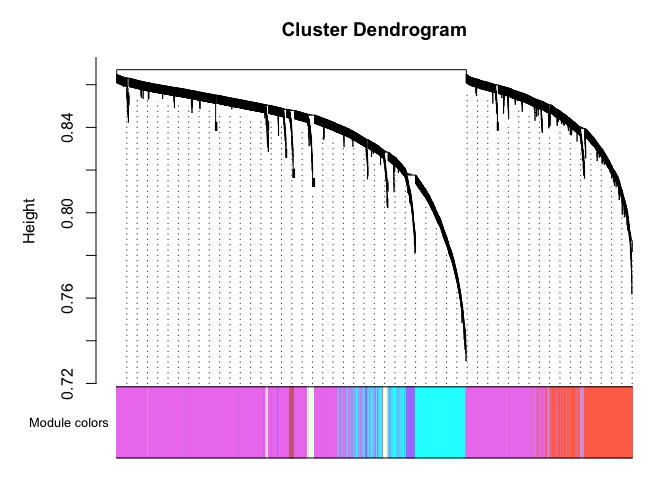
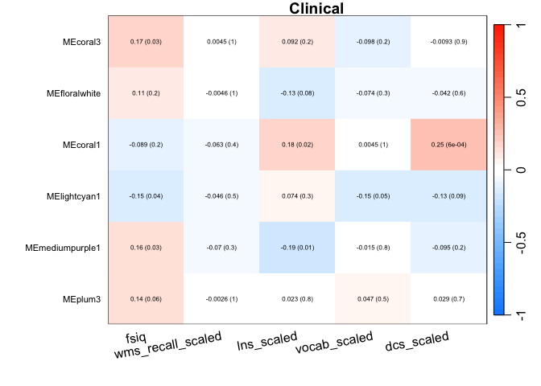
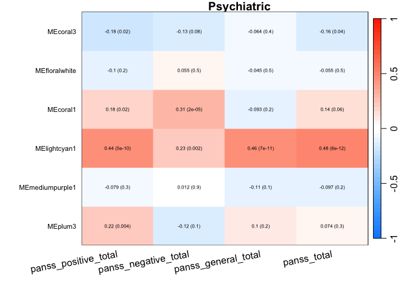

WGCNA
================
Shane Crinion
2025-10-21

### 1. Libraries

``` r
library(WGCNA)
library(DESeq2)
library(tidyr)
library(dplyr)
```

### 2. Import Data

Import the count data, saved as a DESeq2 object.

``` r
# ├── import using dds 
dds <- readRDS('~/Documents/dev/dds_allParticipants_covar_included.rds')

# import gene names
gene_info <- readRDS('~/Documents/dev/dev2/remake/geneIDs.rds')
```

### 3. Construct WGCNA networks

Data was transformed, as required for WGCNA, using VST.

``` r
vsd <- varianceStabilizingTransformation(dds,blind = F)
expression_normalised <- assay(vsd)
input_mat = t(expression_normalised)
rm(vsd, expression_normalised)
```

Use WGCNA to generate the network using the VST-transformed count data.

``` r
picked_power = 3
temp_cor <- cor       
cor <- WGCNA::cor         # Force it to use WGCNA cor function (fix a namespace conflict issue)
netwk <- blockwiseModules(input_mat,randomSeed = 123,           
                          # == Adjacency Function ==
                          power = picked_power,               
                          networkType = "signed",
                          # == Tree and Block Options ==
                          deepSplit = 2,
                           pamRespectsDendro = F,
                          # detectCutHeight = 0.75,
                          minModuleSize = 30,
                          maxBlockSize = 4000,
                          # == Module Adjustments ==
                          reassignThreshold = 0,
                          mergeCutHeight = 0.25,
                          # == Output Options
                          numericLabels = F,
                          verbose = 3)
```

    ##  Calculating module eigengenes block-wise from all genes
    ##    Flagging genes and samples with too many missing values...
    ##     ..step 1
    ##   ..Excluding 11090 genes from the calculation due to too many missing samples or zero variance.
    ##     ..step 2
    ##  ....pre-clustering genes to determine blocks..
    ##    Projective K-means:
    ##    ..k-means clustering..
    ##    ..merging smaller clusters...
    ## Block sizes:
    ## gBlocks
    ##    1    2    3    4    5    6    7    8    9   10   11   12   13   14 
    ## 3999 3998 3997 3996 3996 3996 3995 3995 3991 3988 3988 3987 3965  696 
    ##  ..Working on block 1 .
    ##     TOM calculation: adjacency..
    ##     ..will not use multithreading.
    ##      Fraction of slow calculations: 0.000000
    ##     ..connectivity..
    ##     ..matrix multiplication (system BLAS)..
    ##     ..normalization..
    ##     ..done.
    ##  ....clustering..
    ##  ....detecting modules..
    ##  ....calculating module eigengenes..
    ##  ....checking kME in modules..
    ##      ..removing 2132 genes from module 1 because their KME is too low.
    ##      ..removing 234 genes from module 2 because their KME is too low.
    ##      ..removing 2 genes from module 3 because their KME is too low.
    ##      ..removing 2 genes from module 4 because their KME is too low.
    ##      ..removing 1 genes from module 5 because their KME is too low.
    ##  ..Working on block 2 .
    ##     TOM calculation: adjacency..
    ##     ..will not use multithreading.
    ##      Fraction of slow calculations: 0.000000
    ##     ..connectivity..
    ##     ..matrix multiplication (system BLAS)..
    ##     ..normalization..
    ##     ..done.
    ##  ....clustering..
    ##  ....detecting modules..
    ##  ....calculating module eigengenes..
    ##  ....checking kME in modules..
    ##      ..removing 1801 genes from module 1 because their KME is too low.
    ##      ..removing 571 genes from module 2 because their KME is too low.
    ##  ..Working on block 3 .
    ##     TOM calculation: adjacency..
    ##     ..will not use multithreading.
    ##      Fraction of slow calculations: 0.000000
    ##     ..connectivity..
    ##     ..matrix multiplication (system BLAS)..
    ##     ..normalization..
    ##     ..done.
    ##  ....clustering..
    ##  ....detecting modules..
    ##  ....calculating module eigengenes..
    ##  ....checking kME in modules..
    ##      ..removing 1077 genes from module 1 because their KME is too low.
    ##      ..removing 495 genes from module 2 because their KME is too low.
    ##  ..Working on block 4 .
    ##     TOM calculation: adjacency..
    ##     ..will not use multithreading.
    ##      Fraction of slow calculations: 0.000000
    ##     ..connectivity..
    ##     ..matrix multiplication (system BLAS)..
    ##     ..normalization..
    ##     ..done.
    ##  ....clustering..
    ##  ....detecting modules..
    ##  ....calculating module eigengenes..
    ##  ....checking kME in modules..
    ##      ..removing 609 genes from module 1 because their KME is too low.
    ##      ..removing 36 genes from module 2 because their KME is too low.
    ##  ..Working on block 5 .
    ##     TOM calculation: adjacency..
    ##     ..will not use multithreading.
    ##      Fraction of slow calculations: 0.000000
    ##     ..connectivity..
    ##     ..matrix multiplication (system BLAS)..
    ##     ..normalization..
    ##     ..done.
    ##  ....clustering..
    ##  ....detecting modules..
    ##  ....calculating module eigengenes..
    ##  ....checking kME in modules..
    ##      ..removing 2351 genes from module 1 because their KME is too low.
    ##  ..Working on block 6 .
    ##     TOM calculation: adjacency..
    ##     ..will not use multithreading.
    ##      Fraction of slow calculations: 0.000000
    ##     ..connectivity..
    ##     ..matrix multiplication (system BLAS)..
    ##     ..normalization..
    ##     ..done.
    ##  ....clustering..
    ##  ....detecting modules..
    ##  ....calculating module eigengenes..
    ##  ....checking kME in modules..
    ##      ..removing 856 genes from module 1 because their KME is too low.
    ##      ..removing 872 genes from module 2 because their KME is too low.
    ##      ..removing 54 genes from module 3 because their KME is too low.
    ##      ..removing 1 genes from module 4 because their KME is too low.
    ##      ..removing 1 genes from module 5 because their KME is too low.
    ##      ..removing 2 genes from module 6 because their KME is too low.
    ##      ..removing 1 genes from module 11 because their KME is too low.
    ##      ..removing 1 genes from module 14 because their KME is too low.
    ##  ..Working on block 7 .
    ##     TOM calculation: adjacency..
    ##     ..will not use multithreading.
    ##      Fraction of slow calculations: 0.000000
    ##     ..connectivity..
    ##     ..matrix multiplication (system BLAS)..
    ##     ..normalization..
    ##     ..done.
    ##  ....clustering..
    ##  ....detecting modules..
    ##  ....calculating module eigengenes..
    ##  ....checking kME in modules..
    ##      ..removing 753 genes from module 1 because their KME is too low.
    ##      ..removing 124 genes from module 2 because their KME is too low.
    ##  ..Working on block 8 .
    ##     TOM calculation: adjacency..
    ##     ..will not use multithreading.
    ##      Fraction of slow calculations: 0.000000
    ##     ..connectivity..
    ##     ..matrix multiplication (system BLAS)..
    ##     ..normalization..
    ##     ..done.
    ##  ....clustering..
    ##  ....detecting modules..
    ##  ....calculating module eigengenes..
    ##  ....checking kME in modules..
    ##      ..removing 2143 genes from module 1 because their KME is too low.
    ##      ..removing 351 genes from module 2 because their KME is too low.
    ##  ..Working on block 9 .
    ##     TOM calculation: adjacency..
    ##     ..will not use multithreading.
    ##      Fraction of slow calculations: 0.000000
    ##     ..connectivity..
    ##     ..matrix multiplication (system BLAS)..
    ##     ..normalization..
    ##     ..done.
    ##  ....clustering..
    ##  ....detecting modules..
    ##  ....calculating module eigengenes..
    ##  ....checking kME in modules..
    ##      ..removing 1315 genes from module 1 because their KME is too low.
    ##      ..removing 70 genes from module 2 because their KME is too low.
    ##  ..Working on block 10 .
    ##     TOM calculation: adjacency..
    ##     ..will not use multithreading.
    ##      Fraction of slow calculations: 0.000000
    ##     ..connectivity..
    ##     ..matrix multiplication (system BLAS)..
    ##     ..normalization..
    ##     ..done.
    ##  ....clustering..
    ##  ....detecting modules..
    ##  ....calculating module eigengenes..
    ##  ....checking kME in modules..
    ##      ..removing 283 genes from module 1 because their KME is too low.
    ##      ..removing 248 genes from module 2 because their KME is too low.
    ##      ..removing 57 genes from module 3 because their KME is too low.
    ##      ..removing 72 genes from module 4 because their KME is too low.
    ##      ..removing 81 genes from module 5 because their KME is too low.
    ##      ..removing 23 genes from module 6 because their KME is too low.
    ##      ..removing 25 genes from module 7 because their KME is too low.
    ##      ..removing 19 genes from module 8 because their KME is too low.
    ##      ..removing 15 genes from module 9 because their KME is too low.
    ##      ..removing 15 genes from module 10 because their KME is too low.
    ##      ..removing 16 genes from module 11 because their KME is too low.
    ##      ..removing 15 genes from module 12 because their KME is too low.
    ##      ..removing 12 genes from module 13 because their KME is too low.
    ##      ..removing 6 genes from module 14 because their KME is too low.
    ##      ..removing 9 genes from module 15 because their KME is too low.
    ##      ..removing 10 genes from module 16 because their KME is too low.
    ##      ..removing 13 genes from module 17 because their KME is too low.
    ##      ..removing 4 genes from module 18 because their KME is too low.
    ##      ..removing 4 genes from module 19 because their KME is too low.
    ##      ..removing 14 genes from module 20 because their KME is too low.
    ##      ..removing 3 genes from module 21 because their KME is too low.
    ##      ..removing 12 genes from module 22 because their KME is too low.
    ##      ..removing 9 genes from module 23 because their KME is too low.
    ##      ..removing 3 genes from module 24 because their KME is too low.
    ##      ..removing 11 genes from module 25 because their KME is too low.
    ##      ..removing 8 genes from module 26 because their KME is too low.
    ##      ..removing 6 genes from module 27 because their KME is too low.
    ##      ..removing 2 genes from module 28 because their KME is too low.
    ##      ..removing 2 genes from module 29 because their KME is too low.
    ##      ..removing 2 genes from module 30 because their KME is too low.
    ##      ..removing 3 genes from module 31 because their KME is too low.
    ##      ..removing 2 genes from module 32 because their KME is too low.
    ##      ..removing 3 genes from module 33 because their KME is too low.
    ##      ..removing 13 genes from module 34 because their KME is too low.
    ##      ..removing 5 genes from module 35 because their KME is too low.
    ##      ..removing 3 genes from module 36 because their KME is too low.
    ##      ..removing 3 genes from module 37 because their KME is too low.
    ##      ..removing 2 genes from module 38 because their KME is too low.
    ##      ..removing 4 genes from module 39 because their KME is too low.
    ##      ..removing 2 genes from module 40 because their KME is too low.
    ##      ..removing 5 genes from module 41 because their KME is too low.
    ##      ..removing 2 genes from module 42 because their KME is too low.
    ##  ..Working on block 11 .
    ##     TOM calculation: adjacency..
    ##     ..will not use multithreading.
    ##      Fraction of slow calculations: 0.000000
    ##     ..connectivity..
    ##     ..matrix multiplication (system BLAS)..
    ##     ..normalization..
    ##     ..done.
    ##  ....clustering..
    ##  ....detecting modules..
    ##  ....calculating module eigengenes..
    ##  ....checking kME in modules..
    ##      ..removing 2638 genes from module 1 because their KME is too low.
    ##      ..removing 2 genes from module 2 because their KME is too low.
    ##      ..removing 11 genes from module 3 because their KME is too low.
    ##  ..Working on block 12 .
    ##     TOM calculation: adjacency..
    ##     ..will not use multithreading.
    ##      Fraction of slow calculations: 0.000000
    ##     ..connectivity..
    ##     ..matrix multiplication (system BLAS)..
    ##     ..normalization..
    ##     ..done.
    ##  ....clustering..
    ##  ....detecting modules..
    ##  ....calculating module eigengenes..
    ##  ....checking kME in modules..
    ##      ..removing 833 genes from module 1 because their KME is too low.
    ##      ..removing 358 genes from module 2 because their KME is too low.
    ##      ..removing 436 genes from module 3 because their KME is too low.
    ##      ..removing 133 genes from module 4 because their KME is too low.
    ##      ..removing 4 genes from module 5 because their KME is too low.
    ##  ..Working on block 13 .
    ##     TOM calculation: adjacency..
    ##     ..will not use multithreading.
    ##      Fraction of slow calculations: 0.000000
    ##     ..connectivity..
    ##     ..matrix multiplication (system BLAS)..
    ##     ..normalization..
    ##     ..done.
    ##  ....clustering..
    ##  ....detecting modules..
    ##  ....calculating module eigengenes..
    ##  ....checking kME in modules..
    ##      ..removing 3111 genes from module 1 because their KME is too low.
    ##  ..Working on block 14 .
    ##     TOM calculation: adjacency..
    ##     ..will not use multithreading.
    ##      Fraction of slow calculations: 0.000000
    ##     ..connectivity..
    ##     ..matrix multiplication (system BLAS)..
    ##     ..normalization..
    ##     ..done.
    ##  ....clustering..
    ##  ....detecting modules..
    ##  ....calculating module eigengenes..
    ##  ....checking kME in modules..
    ##      ..removing 144 genes from module 1 because their KME is too low.
    ##      ..removing 22 genes from module 2 because their KME is too low.
    ##      ..removing 21 genes from module 3 because their KME is too low.
    ##      ..removing 14 genes from module 4 because their KME is too low.
    ##      ..removing 6 genes from module 5 because their KME is too low.
    ##      ..removing 3 genes from module 6 because their KME is too low.
    ##      ..removing 2 genes from module 7 because their KME is too low.
    ##  ..merging modules that are too close..
    ##      mergeCloseModules: Merging modules whose distance is less than 0.25
    ##        Calculating new MEs...

``` r
cor <- temp_cor     # Return cor function to original namespace
```

*Result:* 11090 genes were removed due to low read counts. In the next
steps, we will inspect the modules created by WGCNA.

### 3. Inspect WGCNA networks

The plot below is used to do a quick inspect of the the module
assignment based on each gene block.

``` r
# Convert labels to colors for plotting
mergedColors = labels2colors(netwk$colors)
#png('DendroAndColors.png',res = )
# Plot the dendrogram and the module colors underneath
plotDendroAndColors(
  netwk$dendrograms[[1]],
  mergedColors[netwk$blockGenes[[1]]],
  "Module colors",
  dendroLabels = FALSE,
  hang = 0.03,
  addGuide = TRUE,
  guideHang = 0.05)
```

<!-- -->

``` r
#dev.off()

module_df <- data.frame(
  gene_id = names(netwk$colors),
  colors = labels2colors(netwk$colors))
```

Extract the module eigengenes to inspect the association of newly
created gene modules with case/control status and timepoint.

``` r
# Get Module Eigengenes per cluster
MEs0 <- moduleEigengenes(input_mat, mergedColors)$eigengenes
rm(input_mat)

# Check that data is the same
all.equal(row.names(colData(dds)), rownames(MEs0))
```

    ## [1] TRUE

Create the design matrix from the `time_point` and `Condition` variable.

``` r
des_mat_tp <- model.matrix(~ as.matrix(colData(dds)['time.point']))
des_mat_cc <- model.matrix(~ as.matrix(colData(dds)['Condition']))
```

### 4. Association analysis with study conditions

#### SZ Status:

``` r
library(dplyr)
library(tidyr)
des_mat_cc <- model.matrix(~ as.matrix(colData(dds)['Condition']))
# lmFit() needs a transposed version of the matrix
fit.cc <- limma::lmFit(t(MEs0), design = des_mat_cc)
# Apply empirical Bayes to smooth standard errors
fit.cc <- limma::eBayes(fit.cc)
# Apply multiple testing correction and obtain stats
lmCC <- limma::topTable(fit.cc, number = ncol(MEs0)) %>%
  tibble::rownames_to_column("module")
```

    ## Removing intercept from test coefficients

``` r
subset(lmCC, adj.P.Val<0.05)
```

    ##          module       logFC      AveExpr         t      P.Value    adj.P.Val
    ## 1 MEfloralwhite -0.05299199 2.165899e-16 -5.068900 9.860861e-07 0.0001005808
    ## 2  MElightcyan1  0.04584274 1.642205e-17  4.308510 2.696818e-05 0.0013753773
    ## 3       MEplum3 -0.04388505 1.751878e-16 -4.106892 6.073406e-05 0.0020649581
    ##           B
    ## 1 4.9030837
    ## 2 1.7341154
    ## 3 0.9632048

*Result:* 3 constructed modules were associated with case/control
status.

#### Stress Test:

``` r
des_mat_tp <- model.matrix(~ as.matrix(colData(dds)['time.point']))
# lmFit() needs a transposed version of the matrix
fit.tp <- limma::lmFit(t(MEs0), design = des_mat_tp)
# Apply empirical Bayes to smooth standard errors
fit.tp <- limma::eBayes(fit.tp)
# Apply multiple testing correction and obtain stats
lmTP <- limma::topTable(fit.tp, number = ncol(MEs0)) %>%
  tibble::rownames_to_column("module")
```

    ## Removing intercept from test coefficients

``` r
subset(lmTP, adj.P.Val<0.05)
```

    ##     module      logFC       AveExpr        t      P.Value    adj.P.Val        B
    ## 1 MEcoral3 -0.0488819 -1.265481e-16 -4.64225 6.615151e-06 0.0006747454 3.073763

*Result:* 1 constructed module was associated with time.point.

#### Interaction

Inspect association of constructed modules with the interaction terms
(time-point x case/control status).

``` r
# Make the interaction term and matrix
ix <- as.matrix(paste0(dds$Condition, '-', dds$time.point))
des_mat_ix <- model.matrix(~ ix)

# lmFit() needs a transposed version of the matrix
fit.ix <- limma::lmFit(t(MEs0), design = des_mat_ix)
# Apply empirical Bayes to smooth standard errors
fit.ix <- limma::eBayes(fit.ix)

# Apply multiple testing correction and obtain stats
lmIX <- limma::topTable(fit.ix, number = ncol(MEs0)) %>%
  tibble::rownames_to_column("module")
```

    ## Removing intercept from test coefficients

``` r
subset(lmIX,  adj.P.Val<0.05)
```

    ##            module ixControl.T3 ixPatient.T1 ixPatient.T3       AveExpr
    ## 1   MEfloralwhite -0.023170266  -0.04519731  -0.08418783  2.165899e-16
    ## 2        MEcoral3 -0.044491308  -0.01742313  -0.07147791 -1.265481e-16
    ## 3        MEcoral1  0.044394374   0.04509917   0.06653969 -3.854941e-18
    ## 4    MElightcyan1  0.001259580   0.04750934   0.04539728  1.642205e-17
    ## 5 MEmediumpurple1 -0.026791369  -0.02521721  -0.06389922  2.047745e-16
    ## 6         MEplum3 -0.001680075  -0.04212722  -0.04736879  1.751878e-16
    ##           F      P.Value    adj.P.Val
    ## 1 12.085352 3.073907e-07 3.135386e-05
    ## 2  8.847784 1.689323e-05 8.615546e-04
    ## 3  7.154291 1.455021e-04 4.947070e-03
    ## 4  6.128724 5.451982e-04 1.390255e-02
    ## 5  5.948949 6.880376e-04 1.403597e-02
    ## 6  5.605097 1.074641e-03 1.826890e-02

*Result:* 6 constructed modules were associated with the interaction
term, suggesting that case/control status influences the
test-participants reaction to the stress test.

### 4. Association of constructed networks with clinical measurements

We also used results from clinical and psychiatric tests to investigate
their association with these constructed gene modules.

Recreate pheno file to select samples that have all the required
covariates.

Import data on environmnetal, neuroimaging and clinical measurements.

``` r
# subjectID, age, sex, tobacco usage and bmi
pheno.1 <- read.csv('~/Downloads/iRELATE_full_wf - iRELATE_full_wf.csv')
#pheno.1 <- pheno.1[,c('SubjectID', 'tobacco', 'age', 'sex', 'bmi')]

# timepoint and condition case/control (from the sample submission file)
pheno.2 <- read.csv('~/Documents/dev/dev2/iRELATE mRNA and cDNA T3.xlsx - NGS sample submission format.csv')
pheno.2 <- pheno.2[c('sample', 'time.point', 'X', 'ID', 'X.1')]
names(pheno.2) <- c('SubjectID', 'time.point', 'Condition', 'ID', 'Plate')
colnames(pheno.2)[3] <- 'Condition'
colnames(pheno.2)[5] <- 'Plate'

# olenzapine concentrate 
pheno.3 <- read.csv('~/Documents/dev/dev2/olz_patient.csv')
```

Merge datasets and view pheno data to ensure it’s imported correctly.

``` r
pheno = merge(pheno.1, pheno.3, by='SubjectID', all.x=T)
pheno = merge(pheno, pheno.2, by='SubjectID', all.x=T)

# remove unnecessary env objects
rm(pheno.1,pheno.2,pheno.3)
```

Make a version of the pheno file for wgcna that contains all the
clinical and psychiatric measurements.

``` r
pheno.wgcna <- pheno[!is.na(pheno$ID),]
pheno.wgcna <- subset(pheno.wgcna, ID %in% colnames(dds))

# Assign value as 0 for Olanzepine levels in Controls
pheno.wgcna[pheno.wgcna$Condition=='Control' & is.na(pheno.wgcna$OLZ.equivalents),'OLZ.equivalents'] <- 0

# Convert to factors and level as necessary
pheno.wgcna = pheno.wgcna %>% mutate(
  time.point = factor(time.point, levels=c('T1', 'T3')),
  Condition = factor(Condition, levels=c('Control', 'Patient')),
  tobacco = factor(tobacco, levels = c(0,1)),
  sex = as.factor(sex),
  OLZ.equivalents = as.numeric(scale(OLZ.equivalents, center=T)),
  age = as.numeric(scale(age, center = T)),
  bmi = as.numeric(scale(bmi, center=T)))

# Extract clinical measurements
clinical <- c('fsiq', 'wms_recall_scaled', 'lns_scaled', 'vocab_scaled', 'dcs_scaled')
#psych <- c('')

# Further filtering NAs and unneeded columns
row.names(pheno.wgcna) <- pheno.wgcna$ID
pheno.wgcna <- pheno.wgcna[,c('tobacco','sex','OLZ.equivalents','age','bmi', clinical)]
#pheno.wgcna <- subset(pheno.wgcna, select=-c(SubjectID, time.point, Condition))

na_remove <- 
  c(row.names(pheno.wgcna[is.na(pheno.wgcna$bmi),]),
    row.names(pheno.wgcna[is.na(pheno.wgcna$tobacco),]),
    row.names(pheno.wgcna[is.na(pheno.wgcna$OLZ.equivalents),]),
    row.names(pheno.wgcna[is.na(pheno.wgcna$fsiq),]),
    row.names(pheno.wgcna[is.na(pheno.wgcna$wms_recall_scaled),]),
    row.names(pheno.wgcna[is.na(pheno.wgcna$lns_scaled),]),
    row.names(pheno.wgcna[is.na(pheno.wgcna$vocab_scaled),]),
    row.names(pheno.wgcna[is.na(pheno.wgcna$dcs_scaled),]))

pheno.wgcna <- pheno.wgcna[!row.names(pheno.wgcna) %in% na_remove,]
```

Extract and prepare the eigenegenes found to be significantly associated
with case-control status, time-point or both.

``` r
#Relating modules to characteristics and identifying important genes
#Defining the number of genes and samples
nGenes = ncol(expression)
nSamples = nrow(pheno.wgcna)

# Recalculating MEs with label colors
MEs = orderMEs(MEs0)
MEs = MEs[,c('MEcoral3','MEfloralwhite', 'MEcoral1', 'MElightcyan1', 'MEmediumpurple1', 'MEplum3')]
```

Calculate the correlation between the modules and clinical measurments.

``` r
moduleTraitCor = WGCNA::cor(MEs, pheno.wgcna[,clinical], use = "p")
moduleTraitPvalue = corPvalueStudent(moduleTraitCor, nSamples)

#sizeGrWindow(8,4)
#Displaying correlations and its p-values
textMatrix =  paste(signif(moduleTraitCor, 2), " (",
                    signif(moduleTraitPvalue, 1), ")", sep = "")
dim(textMatrix) = dim(moduleTraitCor)
```

Generate the association plot for the numeric traits.

``` r
#png('~/Documents/dev/thesis_followup/moduleTraitRelationships_clinical.png', height= 3, res = 300, unit='in', width=8)
#Displaying the correlation values in a heatmap plot
par(mar=c(4,7,1,1))
labeledHeatmap(Matrix = moduleTraitCor,
               xLabels = names(pheno.wgcna[,clinical]),
                 xLabelsAngle = 10,
               yLabels = paste0('   ',names(MEs)),
               ySymbols = names(MEs),
               colorLabels = FALSE,
               colors = blueWhiteRed(50),
               textMatrix = textMatrix,
               setStdMargins = FALSE,
               cex.text = 0.5,
               cex.lab.y = 0.7,
               zlim = c(-1,1),
               main = paste("Clinical"))
```

<!-- -->

``` r
#dev.off()
```

### 5. Association of constructed networks with psychiatric measurements (cases only)

Create a version of pheno file for just the cases who have all the POMMS
measurements

``` r
pheno.cases <- subset(pheno, Condition=='Patient')
# make a version of the pheno file for wgcna that contains all the 
pheno.cases <- pheno.cases[!is.na(pheno.cases$ID),]
row.names(pheno.cases) <- pheno.cases$ID
pheno.cases <- subset(pheno.cases, ID %in% colnames(dds)) # only the 97 QC-passed cases

# Extract the psych phenos
neuropsych <- grep(pattern = 'panss', x=names(pheno.cases), value=T)
neuropsych <- c('panss_positive_total', 'panss_negative_total', 'panss_general_total', 'panss_total')
pheno.cases <- pheno.cases[!pheno.cases$panss_negative_total=='999',neuropsych]
```

Calculate the correlation between the modules and psychiatric
measurements.

``` r
#Relating modules to characteristics and identifying important genes
#Defining the number of genes and samples
nGenes = ncol(expression)
nSamples.cases = nrow(pheno.cases)
```

Recalculating MEs with label colors

``` r
# Extract significant MEs
MEs.cases = orderMEs(MEs0)[,c('MEcoral3','MEfloralwhite', 'MEcoral1', 'MElightcyan1', 'MEmediumpurple1', 'MEplum3')]
MEs.cases = MEs.cases[intersect(rownames(MEs.cases), row.names(pheno.cases)),]
pheno.cases = pheno.cases[intersect(rownames(MEs.cases), row.names(pheno.cases)),]

# Calculate correlation 
moduleTraitCor.cases = WGCNA::cor(MEs.cases, pheno.cases, use = "p")
moduleTraitPvalue.cases = corPvalueStudent(moduleTraitCor.cases, nSamples)

#sizeGrWindow(8,4)
#Displaying correlations and its p-values
textMatrix.cases =  paste(signif(moduleTraitCor.cases, 2), " (",
                    signif(moduleTraitPvalue.cases, 1), ")", sep = "")
dim(textMatrix.cases) = dim(moduleTraitCor.cases)
```

Plot the correlations between significant modules and psychiatric
measurements.

``` r
#png('~/Documents/dev/thesis_followup/moduleTraitRelationships_psychiatric.png', 
#    res = 300, height = 3,
#    unit='in', width = 8)
#Displaying the correlation values in a heatmap plot
par(mar=c(4,7,1,1))
labeledHeatmap(Matrix = moduleTraitCor.cases,
               xLabels = names(pheno.cases),
                 xLabelsAngle = 10,
               yLabels = paste0('    ',names(MEs.cases)),
               ySymbols = names(MEs.cases),
               colorLabels = FALSE,
               colors = blueWhiteRed(50),
               textMatrix = textMatrix.cases,
               setStdMargins = FALSE,
               cex.text = 0.5,
               cex.lab.y = 0.7,
               zlim = c(-1,1),
               main = paste("Psychiatric"))
```

<!-- -->

``` r
#dev.off()
```
